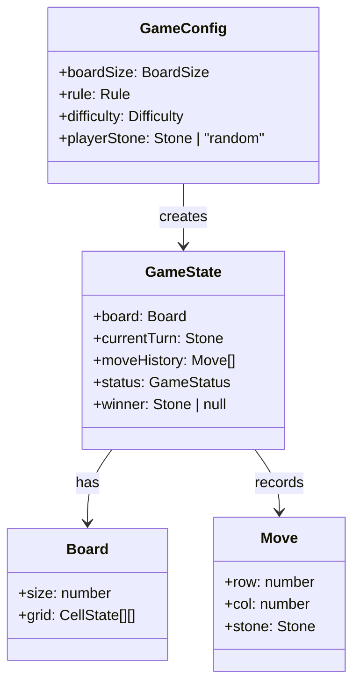
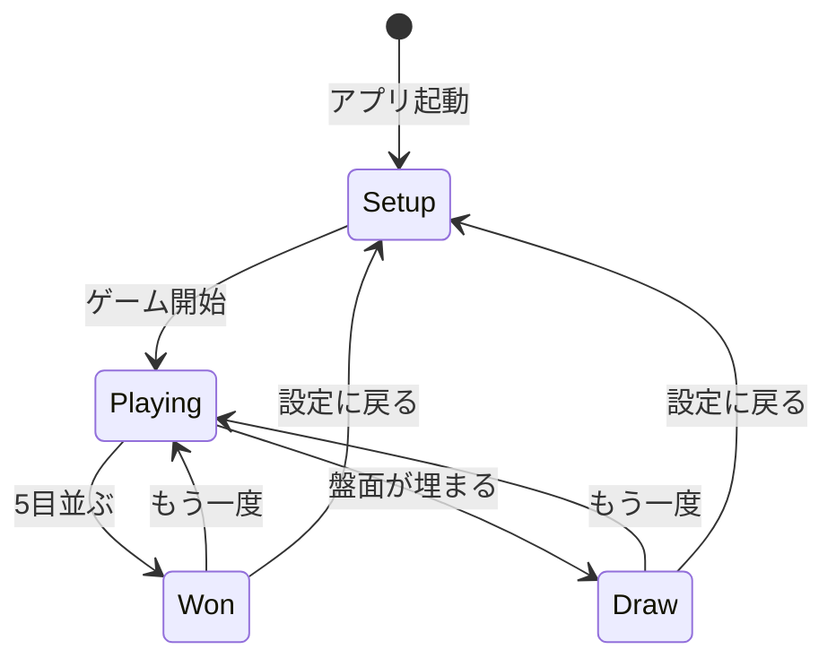
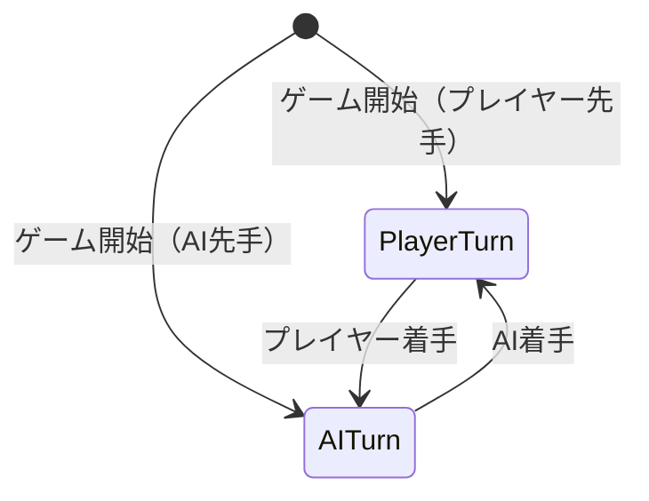
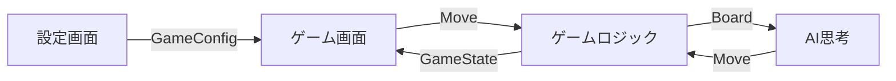

# Gomoku（五目並べ） - 設計仕様書

> **バージョン**: 1.0

## 1. 概要

ブラウザ上で遊べる五目並べゲーム。AI対戦専用で、盤面サイズ・禁じ手ルール・AI難易度・先手/後手を開始前に選択できる。Next.js 16 (App Router) + React 19 + TypeScript + Tailwind CSS v4 で構築する。

## 2. 背景と課題

### 2.1 現状

agent-lab リポジトリ内の gomoku プロジェクトとして環境構築（Next.js、Vitest、ESLint 等）は完了済み。ゲームロジックおよび UI は未実装で、ボイラープレートの状態。

### 2.2 課題

- ゲームとして遊べるものがまだ何もない
- AI対戦を含む設計方針が未定のまま実装に入るとアーキテクチャが歪む

### 2.3 この設計で解決すること

- ゲームロジック・AI・UI の責務分離とデータフローを定義する
- feature ベースのフォルダ構成に沿った設計を確定させ、一貫性のある実装基盤を作る

## 3. スコープ

### 3.1 対象

- AI対戦モード（CPU vs プレイヤー）
- 盤面サイズ選択（9x9, 13x13, 15x15, 19x19）
- 禁じ手ルール選択（フリールール / 連珠ルール）
- AI難易度選択（入門・初級・中級・上級）
- 先手/後手選択（先手・後手・ランダム）
- 着手の取り消し（undo）機能
- 勝敗判定・引き分け判定
- 設定画面（専用ページ）
- ゲーム画面
- 結果表示（もう一度 / 設定に戻る）

### 3.2 対象外

- ローカル2人対戦（人間同士の対戦）
- オンライン対戦（ネットワーク対戦）
- ユーザー認証・アカウント管理
- 対戦履歴の保存・統計
- サウンド・アニメーション演出
- モバイルネイティブ対応（レスポンシブWebは対応する）

### 3.3 境界条件

| 境界 | 内側（この設計の責務） | 外側（この設計の責務外） |
|:-----|:--------------------|:----------------------|
| 対戦相手 | AIのみ | 人間同士・オンライン対戦 |
| データ永続化 | ゲーム進行中のインメモリ状態のみ | DB保存・対戦履歴 |
| プラットフォーム | Webブラウザ | ネイティブアプリ |

## 4. 用語定義

| 用語 | 定義 | コード上の表現 |
|:-----|:-----|:-------------|
| 盤面 | 碁盤の目状のゲームフィールド | `Board` |
| 交点 | 盤面上の石を置ける位置 | `Intersection` |
| 石 | プレイヤーが交点に置く駒（黒 or 白） | `Stone` (`"black"` \| `"white"`) |
| 着手 | プレイヤーが石を置く行為 | `Move` |
| 手番 | 現在石を置くべきプレイヤー | `currentTurn` |
| 禁じ手 | 連珠ルールにおける黒の禁止着手 | `ForbiddenMove` |
| 三三 | 黒が同時に2つの活三を作る禁じ手 | `doubleThree` |
| 四四 | 黒が同時に2つの四を作る禁じ手 | `doubleFour` |
| 長連 | 6目以上連続する禁じ手 | `overline` |

## 5. 設計判断

### DJ-001: AIアルゴリズムに Minimax + αβ剪定を採用

- **判断内容**: AIの思考アルゴリズムとして Minimax + αβ剪定を使用する
- **理由**: 五目並べの探索空間に対して十分な性能を発揮し、探索深さの調整で難易度を直感的に制御できる。実装がシンプルで保守しやすい
- **検討した代替案**:
  - MCTS（モンテカルロ木探索）: 柔軟だが実装が複雑で、五目並べではαβ剪定の方が効率的
  - ランダム + ヒューリスティクス: 実装は最も簡単だが、強さの段階的制御が困難
- **トレードオフ**: 盤面が大きい（19x19）場合や上級難易度では思考時間が長くなる可能性がある。評価関数の品質がAIの強さを左右する
- **影響範囲**: `features/player/` 内のAIモジュール、難易度設定

### DJ-002: 難易度を探索深さで制御

- **判断内容**: AI難易度を Minimax の探索深さ（depth）で段階的に制御する
- **理由**: 探索深さは直感的かつ確実にAIの強さに影響するパラメータであり、実装がシンプル
- **検討した代替案**:
  - 評価関数の精度で制御: 難易度間の差が不安定になりやすい
  - ランダム性を加える: 低難易度がランダムすぎると不自然な手になる
- **トレードオフ**: 深さだけでは微妙な難易度調整が難しい場合がある。将来的に評価関数の重み調整を組み合わせることも可能
- **影響範囲**: AI設定、`features/player/` のAIモジュール

### DJ-003: フロントエンドのみで完結するアーキテクチャ

- **判断内容**: バックエンドを持たず、全ロジックをフロントエンド（React）上で実行する
- **理由**: AI対戦のみのスコープでは、サーバーサイドは不要。デプロイ・運用がシンプルになる
- **検討した代替案**:
  - API サーバーでAI計算: スケーラビリティは上がるが、対戦のみなので過剰
  - Web Worker でAI計算: メインスレッドのブロッキングは避けられるが、初期実装の複雑性が増す
- **トレードオフ**: AIの思考中にUIがブロックされる可能性がある。重い計算の場合は将来 Web Worker への移行を検討
- **影響範囲**: 全体アーキテクチャ

### DJ-004: ゲーム状態を React の state で管理

- **判断内容**: ゲーム状態の管理に外部状態管理ライブラリを使わず、React の useState / useReducer で管理する
- **理由**: ゲーム状態はコンポーネントツリー内で完結し、複雑なクロスコンポーネント共有は不要。依存関係を増やさずシンプルに保てる
- **検討した代替案**:
  - Zustand: 軽量だが、このスコープでは過剰
  - Redux: さらに過剰
- **トレードオフ**: 状態が複雑化した場合に props drilling が発生する可能性がある。その場合は useContext または状態管理ライブラリの導入を検討
- **影響範囲**: `features/game/` のゲーム状態管理

### DJ-005: ページ構成は2ページ構成

- **判断内容**: 設定画面とゲーム画面の2ページ構成にする
- **理由**: 設定画面を専用ページにすることで、ゲーム画面の責務をシンプルに保てる。Next.js App Router のルーティングを活かせる
- **検討した代替案**:
  - SPA（1ページ内で切り替え）: ページ遷移がないため高速だが、URL でゲーム状態を表現できない
- **トレードオフ**: ページ間のデータ受け渡しが必要になる（URL パラメータ or クライアント状態）
- **影響範囲**: `app/` のルーティング構成

## 6. ドメインモデル

### 6.1 モデル図



### 6.2 型定義

#### GameConfig（ゲーム設定）

| 属性 | 型 | 必須 | 説明 | 制約 |
|:-----|:---|:-----|:-----|:-----|
| boardSize | `BoardSize` | Yes | 盤面サイズ | `9 \| 13 \| 15 \| 19` |
| rule | `Rule` | Yes | 適用ルール | `"free" \| "renju"` |
| difficulty | `Difficulty` | Yes | AI難易度 | `"beginner" \| "easy" \| "medium" \| "hard"` |
| playerStone | `Stone \| "random"` | Yes | プレイヤーの石色 | `"black" \| "white" \| "random"` |

#### GameState（ゲーム状態）

| 属性 | 型 | 必須 | 説明 | 制約 |
|:-----|:---|:-----|:-----|:-----|
| board | `Board` | Yes | 現在の盤面 | - |
| currentTurn | `Stone` | Yes | 現在の手番 | `"black" \| "white"` |
| moveHistory | `Move[]` | Yes | 着手履歴 | undo に使用 |
| status | `GameStatus` | Yes | ゲーム状態 | `"playing" \| "won" \| "draw"` |
| winner | `Stone \| null` | Yes | 勝者 | status が `"won"` の時のみ非null |
| config | `GameConfig` | Yes | ゲーム設定 | - |

**不変条件（invariants）**:
- `status` が `"playing"` の場合、`winner` は `null`
- `status` が `"won"` の場合、`winner` は `"black"` or `"white"`
- `status` が `"draw"` の場合、`winner` は `null` かつ盤面の全交点が埋まっている
- `moveHistory` の長さは盤面上の石の数と一致する

#### Board（盤面）

| 属性 | 型 | 必須 | 説明 | 制約 |
|:-----|:---|:-----|:-----|:-----|
| size | `number` | Yes | 盤面の一辺の長さ | `9 \| 13 \| 15 \| 19` |
| grid | `CellState[][]` | Yes | 各交点の状態 | `size × size` の二次元配列 |

#### Move（着手）

| 属性 | 型 | 必須 | 説明 | 制約 |
|:-----|:---|:-----|:-----|:-----|
| row | `number` | Yes | 行番号 | `0 <= row < boardSize` |
| col | `number` | Yes | 列番号 | `0 <= col < boardSize` |
| stone | `Stone` | Yes | 置いた石 | `"black" \| "white"` |

#### 列挙型

```typescript
type Stone = "black" | "white";
type CellState = Stone | null;
type BoardSize = 9 | 13 | 15 | 19;
type Rule = "free" | "renju";
type Difficulty = "beginner" | "easy" | "medium" | "hard";
type GameStatus = "playing" | "won" | "draw";
```

## 7. 振る舞い仕様

### UC-001: ゲーム設定

**トリガー**: ユーザーがトップページ（設定画面）にアクセスする

**事前条件**: なし

**正常フロー**:
1. 設定画面に盤面サイズ・禁じ手ルール・AI難易度・先手/後手の選択UIを表示
2. 各項目にデフォルト値を設定（盤面: 15x15、ルール: フリー、難易度: 中級、石: 先手）
3. ユーザーが各項目を選択する
4. 「ゲーム開始」ボタンを押下する
5. 選択された設定でゲーム画面に遷移する

**事後条件**:
- ゲーム画面が表示され、選択した設定でゲームが開始される

### UC-002: プレイヤーの着手

**トリガー**: プレイヤーの手番中に、盤面の交点をクリックする

**事前条件**:
- ゲーム状態が `"playing"` である
- 現在の手番がプレイヤーである

**正常フロー**:
1. プレイヤーが空の交点をクリックする
2. 禁じ手チェックを実行する（連珠ルールの場合、プレイヤーが黒の時のみ）
3. 交点にプレイヤーの石を配置する
4. 着手を `moveHistory` に記録する
5. 勝敗判定を実行する
6. 勝者なし＆盤面未充填の場合、手番をAIに切り替える

**代替フロー**:
- 既に石がある交点をクリック: 何もしない
- 禁じ手に該当する着手: 着手を拒否し、禁じ手である旨を表示する

**例外フロー**:
- ゲームが終了している状態でのクリック: 何もしない

### UC-003: AIの着手

**トリガー**: 手番がAIに切り替わる

**事前条件**:
- ゲーム状態が `"playing"` である
- 現在の手番がAIである

**正常フロー**:
1. AIが思考中であることをUIに表示する
2. Minimax + αβ剪定で最善手を計算する
3. 計算された交点にAIの石を配置する
4. 着手を `moveHistory` に記録する
5. 勝敗判定を実行する
6. 勝者なし＆盤面未充填の場合、手番をプレイヤーに切り替える

**事後条件**:
- AIの石が盤面に配置されている
- 手番がプレイヤーに戻っている（ゲーム続行の場合）

### UC-004: 着手の取り消し（undo）

**トリガー**: プレイヤーが undo ボタンを押下する

**事前条件**:
- ゲーム状態が `"playing"` である
- `moveHistory` に着手が存在する

**正常フロー**:
1. 直近のAIの着手を `moveHistory` から削除し、盤面から石を除去する
2. 直近のプレイヤーの着手を `moveHistory` から削除し、盤面から石を除去する
3. 手番をプレイヤーに設定する

**代替フロー**:
- 最初の手（プレイヤーの最初の着手のみ）: プレイヤーの着手1つだけを取り消す

**例外フロー**:
- 着手履歴が空の場合: undo ボタンを無効化する

### UC-005: 勝敗判定

**トリガー**: 着手が行われるたびに自動実行

**正常フロー**:
1. 最後に置かれた石を起点に、8方向（横・縦・斜め×2 の各正負方向）で連続する同色の石を数える
2. 5個以上連続していれば勝利（フリールールの場合）
3. 連珠ルールの場合、黒の6目以上連続（長連）は勝利にならない
4. 勝者がいる場合: `status` を `"won"` に、`winner` を設定し、結果表示を行う
5. 盤面が全て埋まっている場合: `status` を `"draw"` に設定し、結果表示を行う

### UC-006: ゲーム終了後の操作

**トリガー**: ゲームが終了する（勝敗または引き分け）

**正常フロー**:
1. 結果（勝敗 or 引き分け）を画面に表示する
2. 「もう一度」ボタンと「設定に戻る」ボタンを表示する
3. 「もう一度」を押下: 同じ設定で新しいゲームを開始する
4. 「設定に戻る」を押下: 設定画面に遷移する

## 8. 状態遷移

### ゲーム状態の遷移



### 手番の遷移



| 遷移 | 開始状態 | 終了状態 | トリガー | ガード条件 | アクション |
|:-----|:---------|:---------|:---------|:----------|:----------|
| ゲーム開始 | Setup | Playing | 「ゲーム開始」押下 | 全設定が選択済み | GameState を初期化、先手の手番を設定 |
| プレイヤー着手 | PlayerTurn | AITurn | 交点クリック | 空の交点 & 禁じ手でない | 石を配置、勝敗判定 |
| AI着手 | AITurn | PlayerTurn | 自動 | - | Minimax で最善手を計算、石を配置、勝敗判定 |
| 勝利 | Playing | Won | 5目以上連続検知 | - | winner を設定、結果表示 |
| 引き分け | Playing | Draw | 全マス充填検知 | 勝者なし | 結果表示 |
| リプレイ | Won/Draw | Playing | 「もう一度」押下 | - | 同じ GameConfig で GameState を再初期化 |
| 設定に戻る | Won/Draw | Setup | 「設定に戻る」押下 | - | 設定画面に遷移 |

**不正な遷移**:
- Setup → Won/Draw: ゲーム開始前に勝敗はない
- Won/Draw → Won/Draw: 終了状態から直接別の終了状態への遷移はない

## 9. データフロー

### 9.1 全体のデータフロー



### 9.2 設定画面からゲーム画面へのデータ受け渡し

設定値は URL の検索パラメータ（query string）で渡す。

| パラメータ | 値 | 例 |
|:----------|:---|:---|
| `size` | `9 \| 13 \| 15 \| 19` | `size=15` |
| `rule` | `free \| renju` | `rule=free` |
| `difficulty` | `beginner \| easy \| medium \| hard` | `difficulty=medium` |
| `stone` | `black \| white \| random` | `stone=black` |

## 10. エラー・例外設計

| ID | エラー | 発生条件 | 深刻度 | 対処方針 | ユーザーへの影響 |
|:---|:-------|:---------|:-------|:---------|:---------------|
| E-001 | 不正な着手位置 | 盤面範囲外の座標 | Low | 着手を無視する | なし（UI上は発生しない） |
| E-002 | 既に石がある位置への着手 | 石が置かれた交点をクリック | Low | 着手を無視する | なし（クリックが無効になるだけ） |
| E-003 | 禁じ手の着手 | 連珠ルールで黒が禁じ手の位置に着手 | Medium | 着手を拒否し、メッセージを表示 | 「この位置は禁じ手です」と表示 |
| E-004 | 不正なURL パラメータ | ゲーム画面に不正な設定値で遷移 | Medium | デフォルト値にフォールバック | デフォルト設定でゲーム開始 |

## 11. 非機能要件

### 11.1 パフォーマンス

| 指標 | 目標値 | 根拠 |
|:-----|:-------|:-----|
| AIの思考時間 | 3秒以内（上級・19x19） | ユーザーの待ち時間として許容できる範囲 |
| UIのレスポンス | 100ms以内 | 着手からの盤面更新が即座に見える |

### 11.2 ブラウザ対応

| ブラウザ | 対応 |
|:---------|:-----|
| Chrome（最新） | 対応 |
| Firefox（最新） | 対応 |
| Safari（最新） | 対応 |
| Edge（最新） | 対応 |

## 12. 制約条件

| 制約 | 内容 | 影響する設計判断 |
|:-----|:-----|:---------------|
| フロントエンドのみ | バックエンドを持たない | DJ-003 |
| Next.js 16 App Router | ルーティングは App Router を使用 | DJ-005 |
| feature ベースフォルダ構成 | CLAUDE.md で定義済みの構成に従う | 全体 |
| pnpm | パッケージマネージャは pnpm を使用 | - |

## 13. 未決事項

| ID | 未決事項 | 影響範囲 | 暫定方針 |
|:---|:---------|:---------|:---------|
| TBD-001 | AI評価関数の具体的な設計（重みや評価パターン） | DJ-001, DJ-002 | 実装フェーズで段階的に調整 |
| TBD-002 | AIの思考時間が長い場合に Web Worker へ移行するか | DJ-003 | まずはメインスレッドで実装し、パフォーマンス計測後に判断 |
| TBD-003 | 連珠ルールの禁じ手判定アルゴリズムの詳細 | UC-002, UC-005 | 実装仕様書で詳細を定義 |

## 14. 参考資料

- `gomoku/` - プロジェクトルート
- `CLAUDE.md` - プロジェクトガイドライン（feature ベースフォルダ構成等）
- `gomoku/README.md` - プロジェクト概要
